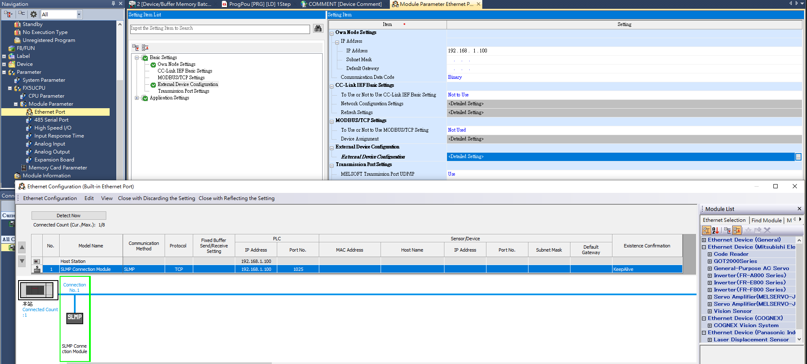

### 說明

- **項目名稱**：
    
    使用 Python 和 Socket 連接 FX5U CPU，實現讀取和寫入功能。

- **支援 PLC**：
    
    FX5U (CPU Ethernet)

- **使用步驟**：

    - **步驟-1:設定PLC環境**：
    
        設定
        IP   : 192.168.1.100    
        PORT : 1025

        

    - **步驟-2:設定PLC環境**：
        
        提供簡單的使用示例，展示如何導入和使用該包。

- **示例**：
    
    提供更多詳細的使用示例和應用場景。
